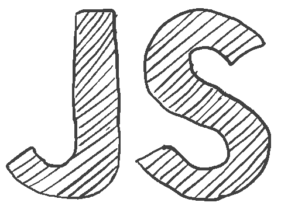

&nbsp;

                           Hi, Pedro Romano here 👋🙇                                                        

  FullStack Web Developer with the ability to carry out web and mobile projects, always thinking about work from organization, communication and efficiency.

  I am committed and super dedicated🖋️, empathic
and I develop very quickly in groups, I really enjoy spending time learning and understanding new processes until I make them my own🤺.

Connect whit me:

Languages and Tools:

◕ JavaScript                                                                                                                                              
◕ ReactJS                                                                                                     
◕ React Native                                                                                                                
◕ Redux                                                                                                         
◕ Node.js                                                                                             
◕ Express                                                                                                                   
◕ Sequelize / PostgreSQL                                                                                                                              
◕ HTML                                                                                      
◕ CSS                                                                                                                                   
◕ TailwindCSS                                                                                                                   
◕ Git & Github                                                                                                      
◕ Scrum                                                                                                     
◕ Kanban

===-==-==-====-=-===-=====-==-====-====-

🛠️ My proyects

◕ PI Video Games Web App

 
 

  
  
  
  

 
◕ PI Video Games Web App

 
 

  
  
  
  

