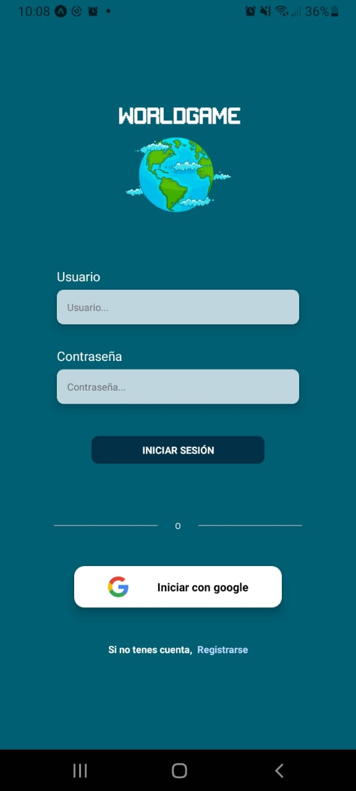
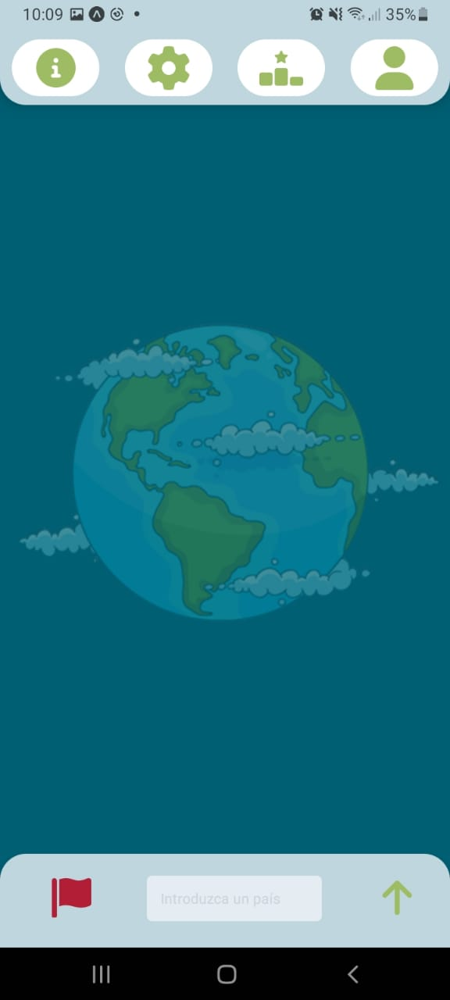
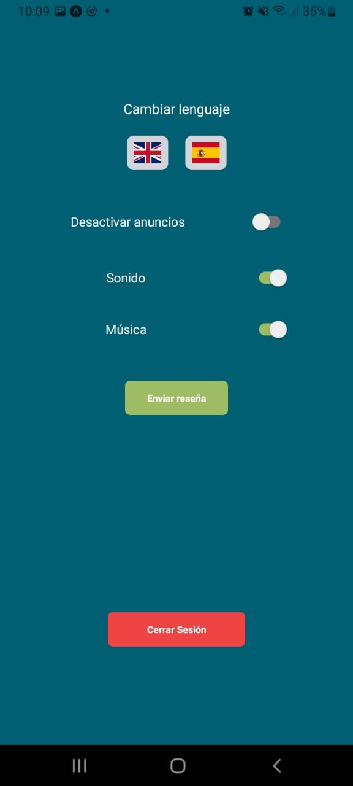
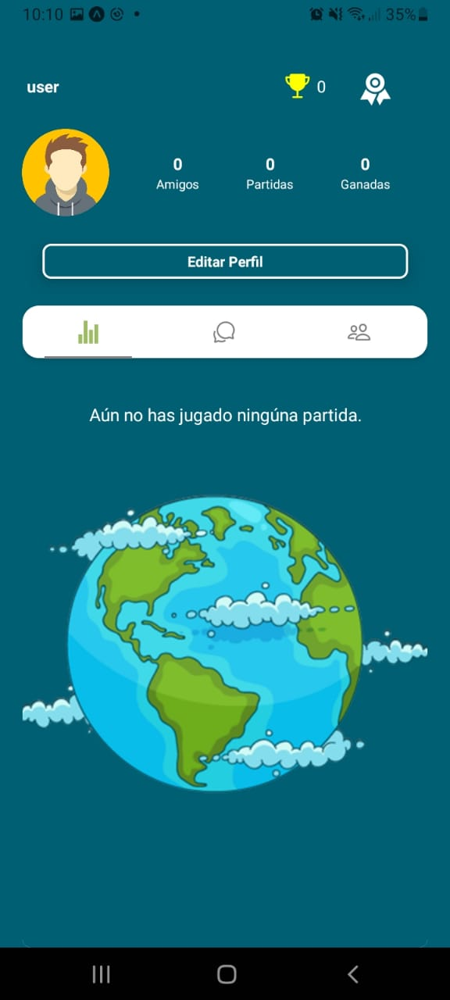
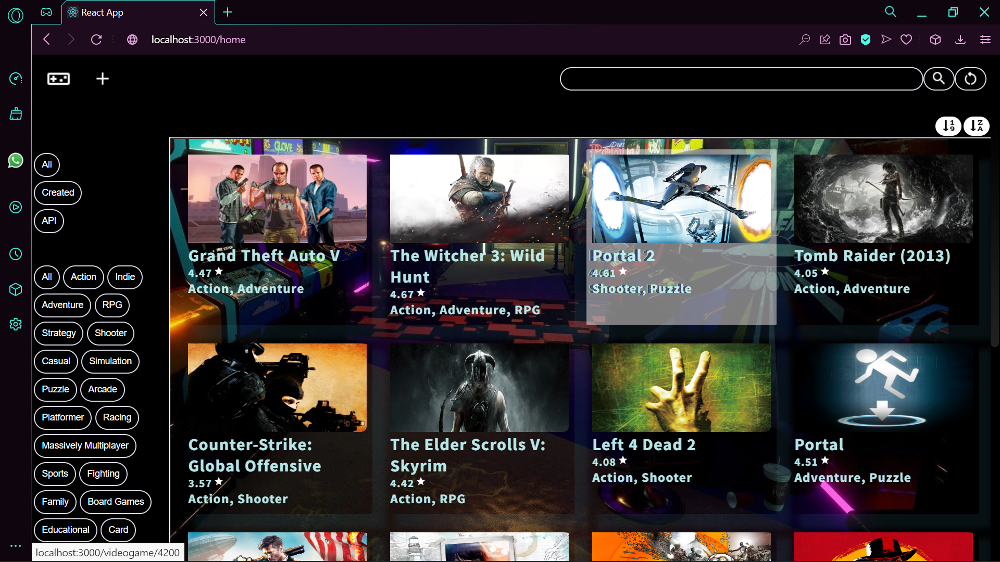
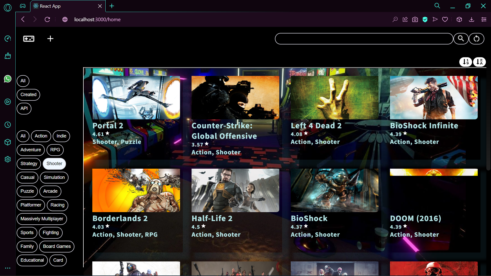
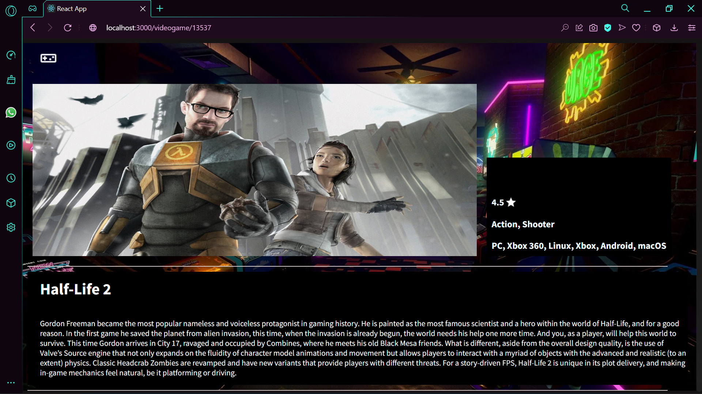
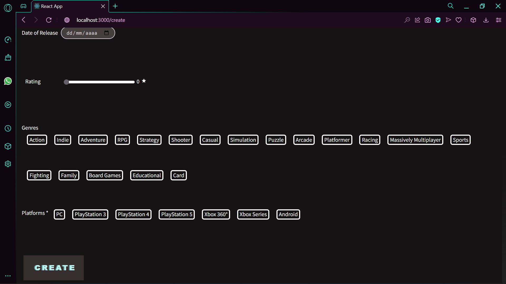

<h1 align="center">Hi, Pedro Romano here 👋🙇</h1>
<h3 align="center">FullStack Web Developer with the ability to carry out web and mobile projects, always thinking about work from organization, communication and efficiency.</h3>

  I am committed and super dedicated🖋️, empathic
and I develop very quickly in groups, I really enjoy spending time learning and understanding new processes until I make them my own🤺.

Languages and Tools:
◕
<ul>
<li><a href="https://developer.mozilla.org/en-US/docs/Web/JavaScript" target="_blank"> JavaScript   </a></li>
  <li><a href="https://www.w3schools.com/css/" target="_blank"> CSS </a> </li>
  <li><a href="https://www.w3schools.com/html/" target="_blank"> HTML </a> </li>
<li><a href="https://reactjs.org/" target="_blank">ReactJS   </a>  </li>
  <li><a href="https://reactnative.dev/" target="_blank">React-Native   </a></li>
  <li><a href="https://redux.js.org" target="_blank"> Redux  </li>
     <li><a href="https://nodejs.org" target="_blank"> Node.js  </a> </li>
    <li><a href="https://expressjs.com" target="_blank"> Express.js  </a> </li>
  <li><a href="https://www.postgresql.org" target="_blank">PostgreSQL   </a> </li>
  <li>
  <a href="https://git-scm.com/" target="_blank"> Git </a> </li>
</ul>

--=-==-==-====-=-===-=====-==-====-====-===-==-==-====-=-===-=====-==-====-====-===-==-==-====-=-===-

🛠️ My proyects

## PF World-Game  

~~~
 🏨 Client and Admin dashboard Bodega Romano Pin 🍇
Freelance Project. 
I worked as Full Stack developer. 
The project contains:
 Web Client with information, and provides the posibilitie to make Requests and Reviews. 
 Admin Dashboard to visualize, edit, delete, create and actualization of data.
 
Tech Utils:
🍇 Database: PostgreSQL
🍇 Back-End: NodeJs, Express, Sequelize
🍇 Front-End: React JS, React Native, Redux, CSS, HTML
🍇 Additional Libraries: 
~~~

 
 
 

  
  
  
  

## PF World-Game  

~~~
📌 A mobile game developed to make geography more fun 🌎
Final group project of Bootcamp Henry. 
I worked as Full Stack & Mobile Developer. 
The project has a mobile version, a web version and an administrator panel.
Tech Utils:
🎮 Database: PostgreSQL
🎮 Back-End: NodeJs, Express, Sequelize
🎮 Front-End: React JS, React Native, Redux, Tailwind, Material-UI, HTML
🎮 Additional Libraries: 
✔ Socket-IO (Integrated chat)
✔ Chart.js (Real-time graphs)
✔ Stripe (Payment gateway)
✔ Cloudinary (Upload profile picture)
✔ Nodemailer (Sending of mails)
~~~

 
 
 

  
  
  
  

##  PI Video Games SPA

~~~
Henry Bootcamp Individual Project 
I worked as a Full-Stack Developer
Design and develop a web page about videogames including:
◉ Search by name
◉ Filtering, Sorting and Pagination
◉ Option to create a videogame
Tech Utils: 
◉ Javascript
◉ ReactJS
◉ Redux
◉ Plain CSS 
◉ NodeJS
◉ Express
◉ PostgreSQL
◉ Sequelize
~~~

 
 

  
  
  
  

 

## Connect whit me:
  
mail: romanopedro25@gmail.com
  

